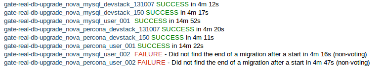

:title: Running

Running
=======

Starting turbo-hipster
----------------------

Turbo-hipster can be run from the command line::

 $ turbo-hipster

This option allows you to pass parameters to turbo-hipster. Use the --help
parameter to see a full list.

+-------+--------------+--------------------------------------------------------+
| Short |    Long      | Description                                            |
+=======+==============+========================================================+
|  -c   | --config     | Print the path to the configuration file and exit      |
+-------+--------------+--------------------------------------------------------+
|  -b   | --background | Run as a daemon in the background                      |
+-------+--------------+--------------------------------------------------------+
|  -p   | --pidfile    | Specify the PID file to lock while running as a daemon |
+-------+--------------+--------------------------------------------------------+

Alternatively, you can start turbo-hipster as a service.

1. Copy the turbo-hipster init.d script to /etc/init.d/:

 $ sudo cp etc/init.d/turbo-hipster /etc/init.d/

2. Reload the script with the default configuration:

 $ sudo update-rc.d turbo-hipster defaults

3. Start the service:

 $ sudo service turbo-hipster start

Plugins
=======

Plugins can be used to extend turbo-hipster's capabilities.

.. note::
 Currently, the only available plugin for turbo-hipster is the
 database migration plugin, ``gate_real_db_upgrade``, which tests code
 against a variety of real-world databases.

Installing plugins
------------------

Turbo-hipster plugins are responsible for handling the jobs that are passed
to it. They must successfully build reports and publish them according to
their configuration. They must also be able to communicate test results back
to Zuul using Gearman.

Plugins must take a standard format in order to be able to work correctly
with turbo-hipster. They must contain a ``task.py`` file with a ``Runner``
class.

Once you have created a turbo-hipster plugin, you need to configure it in
the ``config.yaml`` configuration file.

.. FIXME More config information required here

Plugin: Database migration with ``gate_real_db_upgrade``
--------------------------------------------------------

The database migration plugin, ``gate_real_db_upgrade``, is used to test
datasets against real-world, anonymized, databases.

Migrating a database
--------------------

In order to use turbo-hipster with the ``gate_real_db_upgrade`` plugin, you
need to set up the databases to test against, and point to the plugin in
turbo-hipster's configuration file.

1. Create a directory for the datasets:

 $ mkdir -p /var/lib/turbo-hipster/datasets

2. Copy the json dataset to the directory you created:

 $ cp /my/dataset.json /var/lib/turbo-hipster/datasets/

3. Open the ``/etc/turbo-hipster/config.yaml`` file in your preferred
editor, locate the plugins section, and add this line::

  **plugins**
   gate_real_db_upgrade

Testing with turbo-hipster
==========================

When turbo-hipster completes a test, it sends the result of the test back to
Gearman. These results contain a link to a compiled log file for the test.

If the test fails, or takes too long to complete, turbo-hipster will add a
review to your patchset that looks like this:

Reading test reports
--------------------

An example of a standard log file:
http://thw01.rcbops.com/results/54/54202/5/check/gate-real-db-upgrade_nova_mysql_devstack_150/ddd6d53/20130910_devstack_applied_to_150.log

An example of the same logfile, using the javascript logviewer:
http://thw01.rcbops.com/logviewer/?q=/results/54/54202/5/check/gate-real-db-upgrade_nova_mysql_devstack_150/ddd6d53/20130910_devstack_applied_to_150.log

Test failure codes
------------------

This section gives a list of failure codes, including some steps you can
take for troubleshooting errors:

 FAILURE - Did not find the end of a migration after a start

If you look at the log you should find that a migration began but never
finished. Hopefully there'll be a traceroute for you to follow through to
get some hints about why it failed.

 WARNING - Migration %s took too long

In this case your migration took a long time to run against one of the test
datasets. You should reconsider what operations your migration is performing
and see if there are any optimizations you can make, or if it is really
necessary. If there is no way to speed up your migration you can email us at
rcbau@rcbops.com for an exception.

 FAILURE - Final schema version does not match expectation

Somewhere along the line the migrations stopped and did not reach the
expected version. Our datasets start at previous releases and have to
upgrade all the way through to the most current release. If you see this,
inspect the log for traceroutes or other hints about the failure.

 FAILURE - Could not setup seed database.
 FAILURE - Could not find seed database.

These errors are internal errors. If you see either of these, contact us at
rcbau@rcbops.com to let us know so we can fix and rerun the tests for you.

 FAILURE - Could not import required module.

This error probably shouldn't happen as Jenkins should catch it in the unit
tests before Turbo-Hipster launches. If you see this, please contact us at
rcbau@rcbops.com and let us know.

If you receive an error that you think is a false positive, leave a comment
on the review with the sole contents of "recheck migrations".

If you have any questions/problems please contact us at rcbau@rcbops.com.
